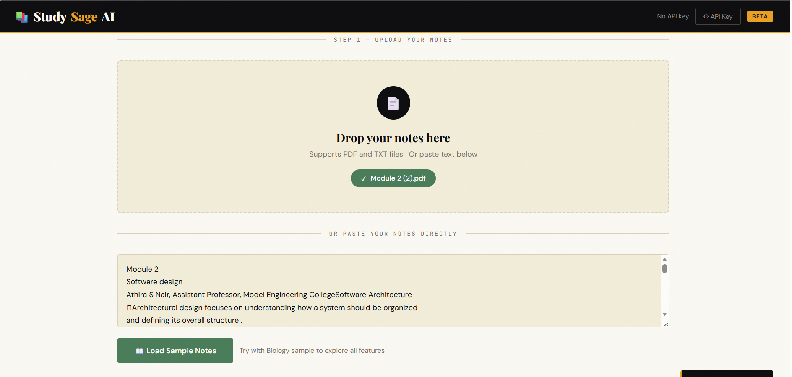
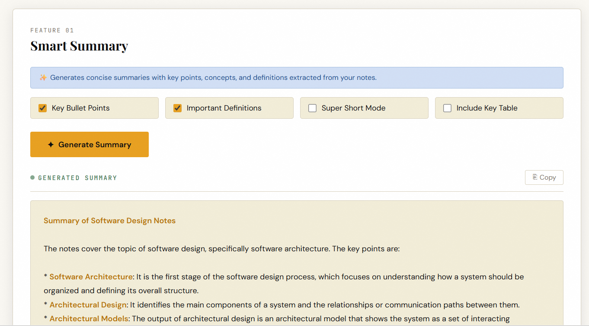
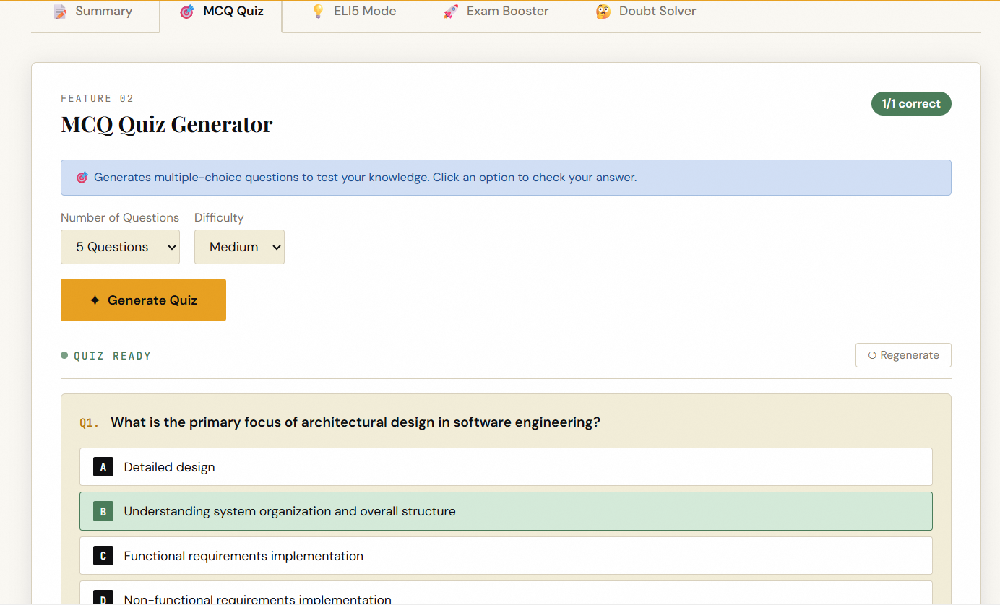
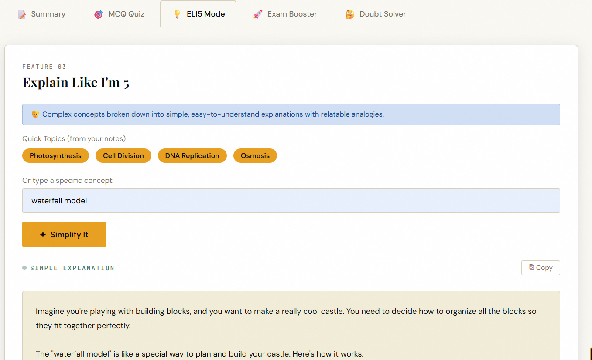
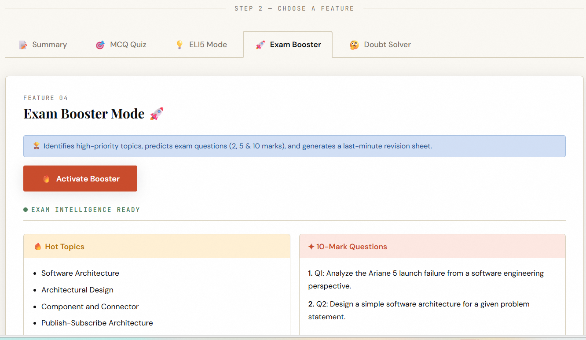

<p align="center">
  
</p>

# 📚 StudySageAI

**StudySageAI** is an AI-powered web-based study assistant that helps students quickly understand, revise, and prepare for exams by converting lengthy study materials into structured, easy-to-digest learning content.

The platform extracts text from uploaded PDF notes and uses advanced AI models to generate:
- Clear summaries
- Key points and definitions
- Practice MCQs
- Simple ELI5 explanations
- Predicted exam questions and revision sheets

It significantly reduces manual study effort and improves learning efficiency.

---

## 👥 Team: MasalaChaya

- **Anna Kurian** – Model Engineering College  
- **Josna Ann Joshy** – Model Engineering College  

---

## 🌐 Live Demo

- https://studysage-ai.onrender.com
---

## 📌 Problem Statement

Students often struggle to study efficiently from large volumes of notes, especially during exam preparation. Traditional study methods require:

- Reading long documents
- Manually summarizing
- Identifying key topics
- Creating practice questions

This process is **time-consuming, repetitive, and inefficient**.

There is a need for an **intelligent system** that can automatically extract, organize, and simplify study materials.

---

## 💡 Solution

**StudySageAI** provides an **AI-driven study assistant** that automates the entire revision process.

It allows students to upload their study materials (PDF notes), after which the system:

- Extracts text from documents
- Generates structured summaries
- Highlights important concepts
- Creates MCQs and exam questions
- Provides simple explanations for difficult topics

The platform acts as a **personalized AI revision coach**, enabling:

✔ Faster revision  
✔ Better understanding  
✔ Improved retention  
✔ Smarter exam preparation  

---

## ⚙️ Tech Stack

### 🖥️ Languages
- Python
- JavaScript
- HTML
- CSS

### 🧠 Frameworks
- Flask (Backend)
- Vanilla JavaScript (Frontend)

### 📚 Libraries & Tools
- PyPDF2 – PDF text extraction  
- Flask-CORS – Cross-origin requests  
- python-dotenv – Environment configuration  
- Groq SDK – AI model integration  

### 🛠️ Development Tools
- VS Code  
- Git & GitHub  
- Postman (API testing)  
- Render (Backend Deployment)  
- Vercel (Frontend Deployment)  

---

## 🚀 Features

### 📄 PDF Upload & Text Extraction
Upload study notes in PDF format and automatically extract readable content.

### 🧠 AI-Powered Smart Summary
Generate structured summaries with bullet points, key concepts, and definitions.

### ❓ MCQ Generator
Create exam-style multiple-choice questions with answers and explanations.

### 👶 ELI5 Concept Explainer
Understand complex topics through simple, relatable explanations.

### ⚡ Exam Booster Module
Get predicted questions, hot topics, and last-minute revision sheets.

### 💬 Doubt Solver Assistant
Ask questions directly from your notes and receive AI-powered answers.

---

## 📸 Screenshots

### 🏠 Home Page


### 📄 PDF Upload & Extraction


### 🧠 Summary Generator


### ❓ MCQ Generator


### 👶 ELI5 Explanation


### ⚡ Exam Booster


---

## 🧩 System Architecture

## Implementation

### For Software:

# 🚀 Installation & Setup

## 📦 Clone the Repository
```bash
git clone https://github.com/AnnaKurian06/new.git
cd studysageai
```

## 🧪 Create & Activate Virtual Environment

```bash
python -m venv venv
```

### ▶ Activate Environment

**Windows**
```bash
venv\Scripts\activate
```

**Mac / Linux**
```bash
source venv/bin/activate
```

## 📥 Install Dependencies
```bash
pip install -r requirements.txt
```

## ▶ Run the Application (Local Development)
```bash
python app.py
```

---

# 🌐 Deployed Application

**Backend (Render):**  
https://studysage-ai.onrender.com/

**Frontend (Vercel):**  
study-sage-ai.vercel.app

---

# 📡 API Documentation

### 🔗 Base URL
```
https://studysage-ai.onrender.com/
```

---

## 📄 1. Extract Text from PDF

### Endpoint
```
POST /api/extract
```

### Description
Uploads a PDF file and extracts readable text from it.

### Request Type
`multipart/form-data`

### Request Body
| Field | Type | Description |
|------|------|------------|
| file | PDF | The PDF file to upload |

### Response
```json
{
  "text": "Extracted text from the uploaded PDF...",
  "text_length": 1250,
  "preview": "First few lines of the document..."
}
```

---

## 🧠 2. Generate Summary

### Endpoint
```
POST /api/summary
```

### Request Body
```json
{
  "notes": "Your notes text",
  "options": {
    "bullets": true,
    "defs": true,
    "short": false
  }
}
```

### Response
```json
{
  "result": "Formatted summary text..."
}
```

---

## ❓ 3. Generate MCQs

### Endpoint
```
POST /api/mcq
```

### Request Body
```json
{
  "notes": "Your notes text",
  "count": 5,
  "difficulty": "medium"
}
```

### Response
```json
{
  "result": "[JSON string containing MCQ objects]"
}
```

---

## 👶 4. ELI5 Explanation

### Endpoint
```
POST /api/eli5
```

### Request Body
```json
{
  "notes": "Your notes text",
  "concept": "Photosynthesis"
}
```

### Response
```json
{
  "result": "Simple explanation..."
}
```

---

## ⚡ 5. Exam Booster

### Endpoint
```
POST /api/booster
```

### Response
```json
{
  "result": "{ JSON object with hot topics, questions, revision points }"
}
```

---

## 💬 6. Doubt Solver

### Endpoint
```
POST /api/doubt
```

### Request Body
```json
{
  "notes": "Your notes text",
  "question": "Explain Calvin cycle"
}
```

### Response
```json
{
  "result": "Answer based on notes..."
}
```

---

# 🧩 Deployment Notes (Render)

### Build Command
```bash
pip install -r requirements.txt
```

### Start Command
```bash
gunicorn app:app
```


# 🎯 Project Summary

StudySageAI is an AI-powered study assistant that converts PDF notes into structured summaries, MCQs, ELI5 explanations, and exam-focused revision material — helping students learn faster and prepare smarter.